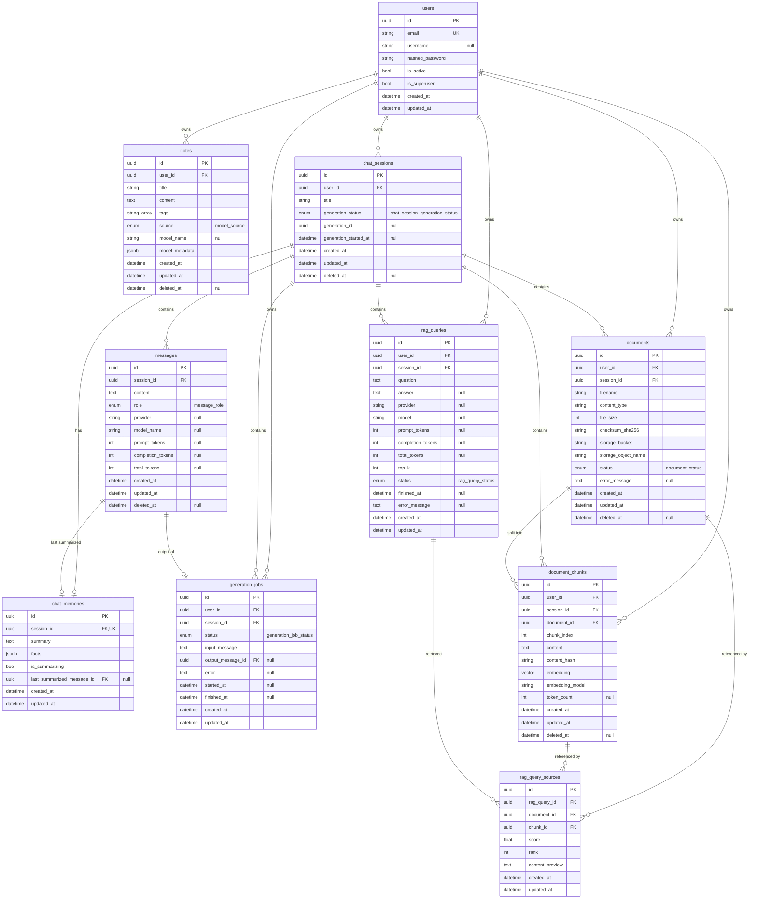

# ⚡ AI Notes API

**AI Notes API** is a production-oriented FastAPI backend for managing AI-related notes, prompts, conversations, and LLM workflows. The project demonstrates clean architecture, async development, PostgreSQL integration, and practical backend patterns for AI engineering.

The assistant is agentic: during chat completions it can call a built-in note toolkit (search, create, read, update, delete notes), and every chat session keeps a long-term memory built from extracted facts and rolling conversation summaries.

## 📦 Dependencies

* [Python 3.13+](https://www.python.org/downloads/)
* [uv](https://docs.astral.sh/uv/getting-started/installation/)
* [Docker](https://docs.docker.com/get-docker/)
* [Task](https://taskfile.dev/)

Runtime services:

* [PostgreSQL](https://www.postgresql.org/) - primary data store
* [Redis](https://redis.io/) - Celery broker and result backend
* [Celery](https://docs.celeryq.dev/) - background worker for async LLM generation jobs and chat memory updates

## 📌 API endpoints

The API is mounted under `/api/v1`.

Authentication endpoints:

* `POST /api/v1/auth/register` - register a new user
* `POST /api/v1/auth/login` - authenticate a user and receive a JWT access token
* `GET /api/v1/auth/me` - get the current authenticated user

Notes endpoints (authenticated):

* `POST /api/v1/notes` - create a note
* `GET /api/v1/notes` - list notes with pagination and filters
* `GET /api/v1/notes/{note_id}` - get a note by ID
* `PATCH /api/v1/notes/{note_id}` - update a note by ID
* `DELETE /api/v1/notes/{note_id}` - delete a note by ID

Chat session endpoints (authenticated):

* `POST /api/v1/chat/sessions` - create a chat session
* `GET /api/v1/chat/sessions` - list chat sessions with pagination and filters
* `GET /api/v1/chat/sessions/{session_id}` - get a chat session by ID
* `PATCH /api/v1/chat/sessions/{session_id}` - update a chat session by ID
* `DELETE /api/v1/chat/sessions/{session_id}` - delete a chat session by ID
* `GET /api/v1/chat/sessions/{session_id}/messages` - list messages in a session
* `GET /api/v1/chat/sessions/{session_id}/memory` - get the long-term memory for a chat session

Chat message endpoints (authenticated):

* `GET /api/v1/chat/messages/{message_id}` - get a message by ID
* `DELETE /api/v1/chat/messages/{message_id}` - delete a message by ID

Chat completion endpoints (authenticated):

* `POST /api/v1/chat/completions/stream` - stream an assistant response over SSE
* `POST /api/v1/chat/completions/jobs` - enqueue an async LLM generation job (Celery)
* `GET /api/v1/chat/completions/jobs/{job_id}` - get the status and result of a generation job

Health endpoint:

* `GET /api/v1/health` - service health check

Authentication details:

* Use `Authorization: Bearer <token>` for protected endpoints
* Tokens are issued by `POST /api/v1/auth/login`
* User registration is handled by `POST /api/v1/auth/register`

Documentation is available at:

* Swagger UI: `http://127.0.0.1:8000/docs`
* Redoc: `http://127.0.0.1:8000/redoc`

## 🔧 Environment variables

The application loads settings from a `.env` file using `pydantic-settings`. Copy `.env.example` to `.env` and update the values before running the app.

Required variables:

* `DISABLE_LOGGING` - `false` or `true`
* `LOG_LEVEL` - e.g. `INFO`, `DEBUG`
* `LOG_PATH` - optional path for file logging
* `POSTGRES_HOST` - PostgreSQL host
* `POSTGRES_PORT` - PostgreSQL port
* `POSTGRES_USER` - PostgreSQL username
* `POSTGRES_PASSWORD` - PostgreSQL password
* `POSTGRES_DB` - PostgreSQL database name
* `JWT_SECRET_KEY` - secret key for signing JWT tokens
* `JWT_ALGORITHM` - JWT signing algorithm, default `HS256`
* `ACCESS_TOKEN_EXPIRE_MINUTES` - token lifetime in minutes
* `OPEN_AI_API_KEY` - OpenAI API key
* `OPEN_AI_MODEL` - chat completion model, e.g. `gpt-4o-mini`
* `OPEN_AI_EMBEDDING_MODEL` - embedding model, e.g. `text-embedding-3-small`
* `OPEN_AI_API_URL` - optional custom OpenAI-compatible base URL
* `OPEN_AI_MAX_OUTPUT_TOKENS` - max tokens per completion
* `LLM_CONTEXT_MESSAGES_LIMIT` - number of recent messages sent as context
* `CELERY_BROKER_URL` - Redis URL for the Celery broker
* `CELERY_RESULT_BACKEND` - Redis URL for the Celery result backend
* `S3_ENDPOINT_URL` - S3 endpoint URL
* `S3_ACCESS_KEY_ID` - S3 access key ID
* `S3_SECRET_ACCESS_KEY` - S3 secret access key
* `S3_REGION` - S3 region name, default `us-east-1`
* `S3_BUCKET_NAME` - bucket used to store documents, default `documents`
* `S3_PRESIGNED_URL_EXPIRE_SECONDS` - presigned document URL lifetime in seconds

The database connection URL is composed automatically from the `POSTGRES_*` values.

## 🚀 Local development

1. Install dependencies and development tools:

```bash
task sync
```

2. Install Git hooks:

```bash
task init
```

3. Start the application locally:

```bash
task run
```

4. Start the Celery worker (requires a running Redis) for async generation jobs:

```bash
task run-celery
```

## 🐳 Docker

Build and run the Docker services:

```bash
task docker
```

Stop Docker services:

```bash
task docker-down
```

## 🧪 Tests and quality checks

* Run tests:

```bash
task test
```

* Run tests with coverage:

```bash
task test-cov
```

* Run linting and type checking:

```bash
task lint
```

* Run full quality gate:

```bash
task check
```

## 🗄 Database schema

Entity-relationship diagram for the database models:



## 🛠 Database migrations

* Create a new Alembic revision:

```bash
task alembic-revision -- "<message>"
```

* Apply migrations:

```bash
task alembic-upgrade
```

* Downgrade one revision:

```bash
task alembic-downgrade
```

## 📜 License

This project is licensed under the MIT License. See [LICENSE.md](./LICENSE.md) for details.
